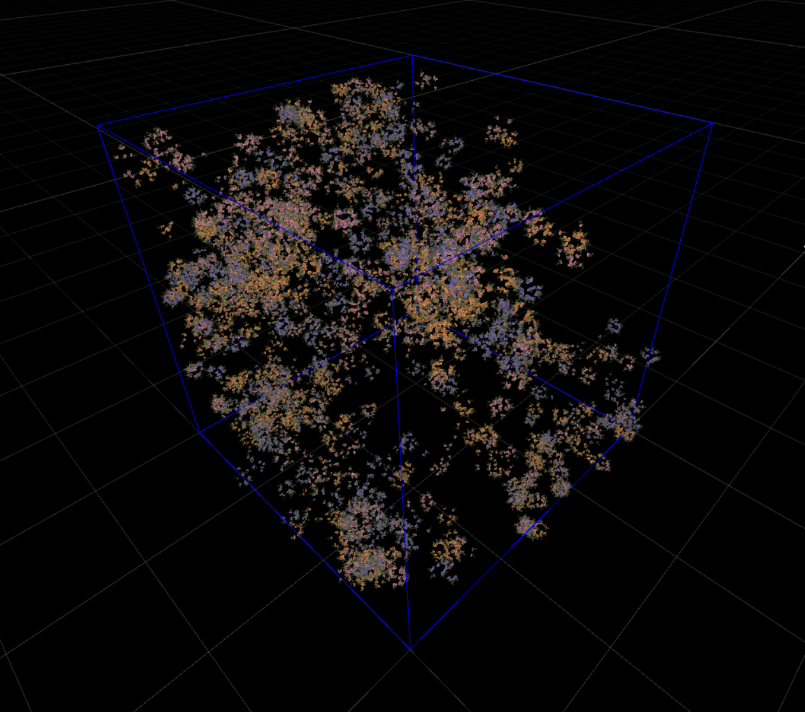

# UMCMC

Instance distributing program using MCMC method.  
This program affords to make fast cluster sampling following proposed scalar field.

this repository including bellow
- 2d/3d metropolis sampling model

## Reference

- https://github.com/nobnak/MCMC

## Including Sources

- https://github.com/nobnak/VertexAnimator
